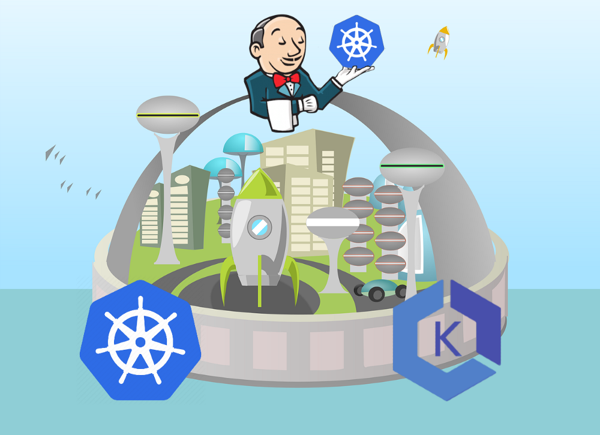
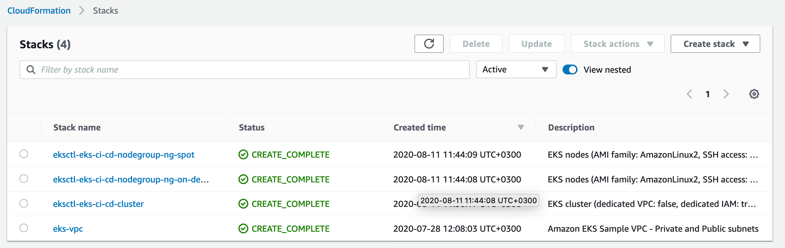
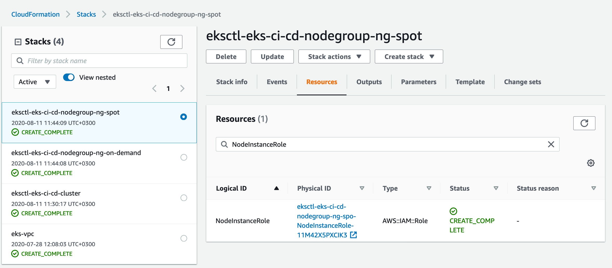
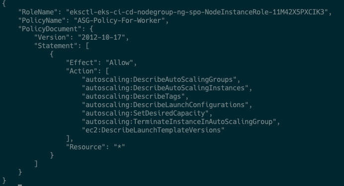
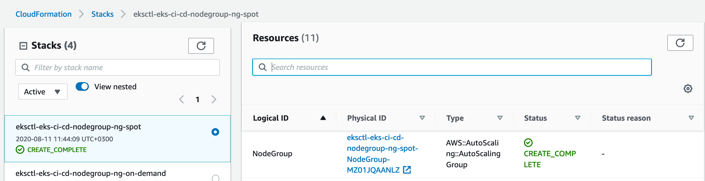
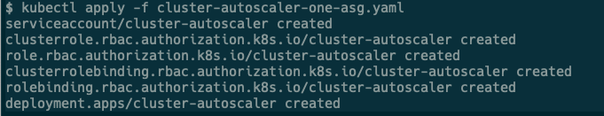
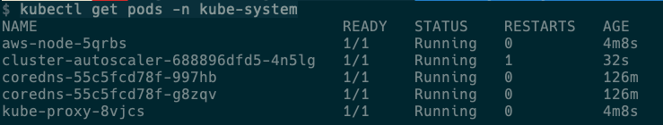
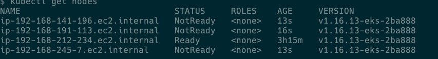
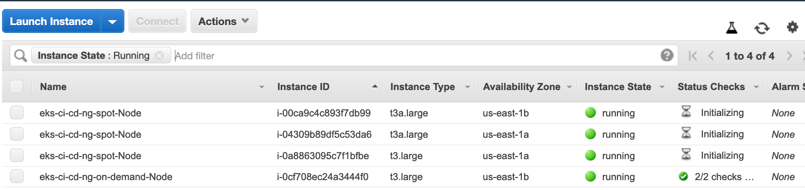

# Building the CI/CD of the Future, Adding the Cluster Autoscaler



In this tutorial, I will share my experience as a DevOps engineer at Cloudify.co, this is the third post of the tutorial in which I will describe how to add Cluster Autoscaler to the EKS cluster we created in the previous post.

### Building the CI/CD of the Future published posts:

* [Introduction](README.md)
* [Creating the VPC for EKS cluster](vpc.md)
* [Creating the EKS cluster](eks.md)
* Adding the Cluster Autoscaler
* [Add Ingress Nginx and Cert-Manager](ingress-cert-manager.md)
* [Install and configure Jenkins](jenkins.md)
* [Create your first pipeline](pipeline.md)

Let’s start.

## What is Cluster Autoscaler?

Cluster Autoscaler is a tool that automatically adjusts the size of the Kubernetes cluster when one of the following conditions is true:
there are pods that failed to run in the cluster due to insufficient resources,
there are nodes in the cluster that have been underutilized for an extended period of time and their pods can be placed on other existing nodes.

[Cluster Autoscaler](https://github.com/kubernetes/autoscaler/tree/master/cluster-autoscaler)

Cluster Autoscaler adjusts the number of nodes for the ‘ng-spot’ node group according to load on the cluster by changing the desired capacity of an AWS Autoscaling Group. To do that Cluster Autoscaler must have certain permissions/policies for this node group, so let’s add them.

## IAM Policy for Cluster Autoscaler

The Cluster Autoscaler requires the following IAM permissions to change the desired capacity of the autoscaling group.

``` json
"Version": "2012-10-17",
  "Statement": [
      {
          "Effect": "Allow",
          "Action": [
              "autoscaling:DescribeAutoScalingGroups",
              "autoscaling:DescribeAutoScalingInstances",
              "autoscaling:DescribeTags",
              "autoscaling:DescribeLaunchConfigurations",
              "autoscaling:SetDesiredCapacity",
              "autoscaling:TerminateInstanceInAutoScalingGroup",
              "ec2:DescribeLaunchTemplateVersions"
          ],
          "Resource": "*"
      }
  ]
}
```

Save it as ‘eks-ca-asg-policy.json’

Let’s apply the policy above, but first, we need to find ‘ng-spot’ node group id.

In AWS account go to Services -> CloudFormation -> Stacks



Go to ‘eksctl-eks-ci-cd-nodegroup-ng-spot’ stack -> Resources



The Physical ID of ‘NodeInstanceRole’ is what we need: ‘eksctl-eks-ci-cd-nodegroup-ng-spo-NodeInstanceRole-11M42X5PXCIK3’

### Applying the policy

``` bash
aws iam put-role-policy --role-name eksctl-eks-ci-cd-nodegroup-ng-spo-NodeInstanceRole-11M42X5PXCIK3 --policy-name ASG-Policy-For-Worker --policy-document file://./eks-ca-asg-policy.json
```

### Checking the policy applied successfully

``` bash
aws iam get-role-policy --role-name eksctl-eks-ci-cd-nodegroup-ng-spo-NodeInstanceRole-11M42X5PXCIK3 --policy-name ASG-Policy-For-Worker
```



Please apply this policy for the ‘ng-static’ group also (although it not managed by CA), otherwise, you will see a lot of errors in Cluster Autoscaler’s logs or CA pod will have an error status.

## Deploy Cluster Autoscaler

To deploy Cluster Autoscaler I will use cluster-autoscaler-one-asg.yaml from here: https://github.com/kubernetes/autoscaler/blob/master/cluster-autoscaler/cloudprovider/aws/examples/cluster-autoscaler-one-asg.yaml

It’s the deployment of Cluster Autoscaler for one Autoscaling Group Only, exactly what we need in our case.

You can see other examples [here](https://github.com/kubernetes/autoscaler/tree/master/cluster-autoscaler/cloudprovider/aws/examples)

We need to modify this file first before apply it.

Look for command section, — nodes line must be changed to the real id of your ‘ng-spot’ node group.



``` yaml
command:
  - ./cluster-autoscaler
  - --v=4
  - --stderrthreshold=info
  - --cloud-provider=aws
  - --skip-nodes-with-local-storage=false
  - --nodes=0:10:eksctl-eks-ci-cd-nodegroup-ng-spot-NodeGroup-MZ01JQAANLZ
```


### Deploy

``` bash
kubectl apply -f cluster-autoscaler-one-asg.yaml
```



## Troubleshooting logs of Cluster Autoscaler

``` bash
kubectl get pods -n kube-system
```



``` bash
kubectl logs cluster-autoscaler-688896dfd5-4n5lg -n kube-system
```

## Testing Scaling

### To test scaling we will deploy 100 Nginx pods

``` bash
kubectl run test-ca-scaling --replicas=100 --image=nginx --port=80
kubectl get nodes
```





In a couple of minutes, you will see new spot instances provisioned.

### Let’s delete those pods now

``` bash
kubectl delete deployment test-ca-scaling
```

It will take something like 10 minutes for Cluster Autoscaler to terminate unneeded nodes.

## Run Windows workflows on EKS

To use windows workflows in our cluster we can add an additional node group to eks-cluster config:

``` yaml
- name: ng-spot-windows
  amiFamily: WindowsServer2019FullContainer
  desiredCapacity: 0
  minSize: 0
  maxSize: 10
  privateNetworking: true
  instancesDistribution:
    instanceTypes: ["t2.large", "t3.large", "m3.large"]
    onDemandBaseCapacity: 0
    onDemandPercentageAboveBaseCapacity: 0
    spotInstancePools: 3
  tags:
    k8s.io/cluster-autoscaler/node-template/label/instance-type: spot-windows
  availabilityZones: ["eu-west-1a", "eu-west-1b", "eu-west-1c"]
  labels:
    instance-type: spot-windows
  iam:
    withAddonPolicies:
      autoScaler: true
```

This node group also will run on spot instances and will use EC2 instances with AMI: WindowsServer2019, you can run pods(containers) with windows based images only on windows worker nodes.

You need to be careful and use the node selector to properly put your pods on correct instances.

If you want to understand how to run properly windows workflows on your EKS cluster, please read my article about it: https://levelup.gitconnected.com/running-workflows-on-windows-with-jenkins-pipeline-and-kubernetes-52752a89a0e7

In the next post, I will explain how to install and configure ‘Ingress Nginx’ and ‘certificate manager’ to your cluster.

Please follow me on [Twitter (@warolv)](https://twitter.com/warolv)

My personal blog in which I will post this tutorial also: http://igorzhivilo.com

This post on my medium account: https://medium.com/swlh/building-the-ci-cd-of-the-future-adding-the-cluster-autoscaler-478ccd57d61d


