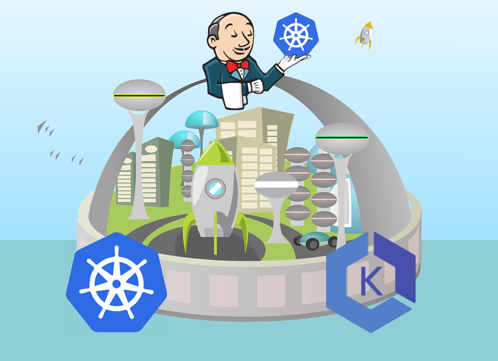
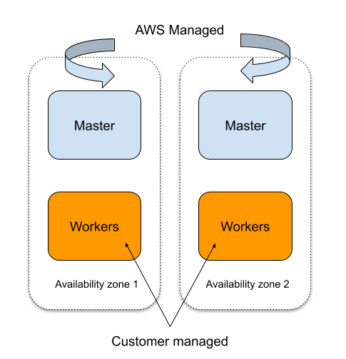
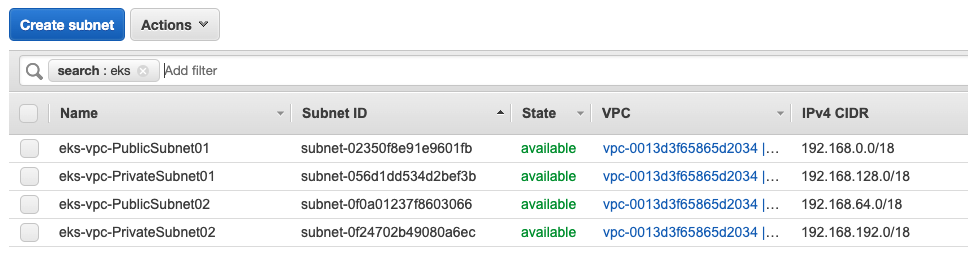
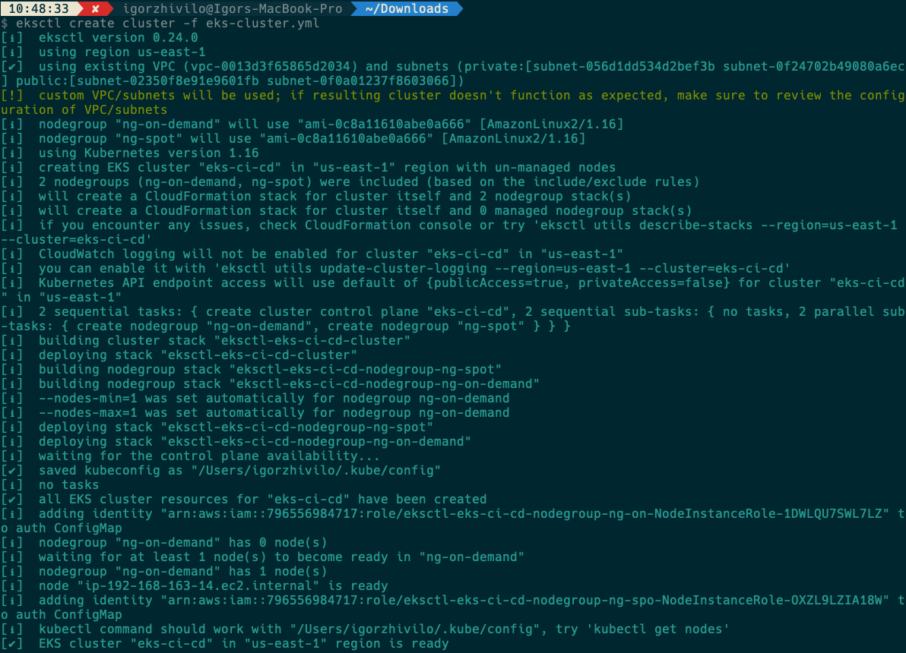
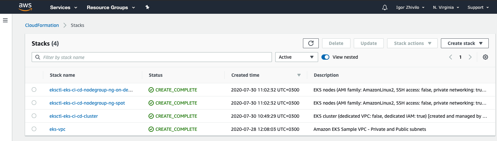
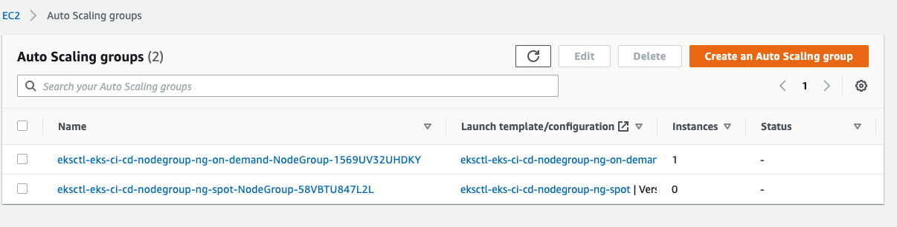
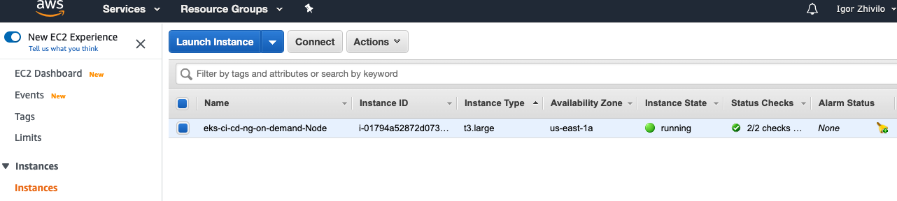
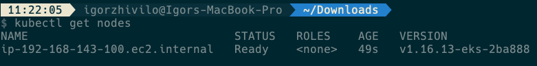

# Building the CI/CD of the Future, creating the EKS cluster



In this tutorial, I will share my experience as a DevOps engineer at Cloudify.co, this is the second post of the tutorial in which I will describe how to create the EKS cluster based on VPC we created in the previous post.

### Building the CI/CD of the Future published posts:

* [Introduction](README.md)
* [Creating the VPC for EKS cluster](vpc.md)
* Creating the EKS cluster

Let’s start.

## What is Amazon EKS?

Amazon Elastic Kubernetes Service (Amazon EKS) is a managed service that makes it easy for you to run Kubernetes on AWS without needing to stand up or maintain your own Kubernetes control plane. Kubernetes is an open-source system for automating the deployment, scaling, and management of containerized applications.

Amazon EKS runs Kubernetes control plane instances across multiple Availability Zones to ensure high availability. Amazon EKS automatically detects and replaces unhealthy control plane instances, and it provides automated version upgrades and patching for them.


[AWS EKS](https://docs.aws.amazon.com/eks/latest/userguide/what-is-eks.html)

## What is eksctl CLI?

eksctl is a simple CLI tool for creating clusters on EKS - Amazon's new managed Kubernetes service for EC2. It is written in Go, uses CloudFormation, was created by Weaveworks and it welcomes contributions from the community

[eksctl](https://eksctl.io/)

## What is AWS spot instances?

A Spot Instance is an unused EC2 instance that is available for less than the On-Demand price. Because Spot Instances enable you to request unused EC2 instances at steep discounts, you can lower your Amazon EC2 costs significantly.

Spot Instances are a cost-effective choice if you can be flexible about when your applications run and if your applications can be interrupted. For example, Spot Instances are well-suited for data analysis, batch jobs, background processing, and optional tasks.

[spot instances](https://docs.aws.amazon.com/AWSEC2/latest/UserGuide/using-spot-instances.html)

## The architecture of the EKS Cluster we building



* We provision our EKS cluster across two availability zones, to protect against a single point of failure. Remember the VPC we created in two availability zones in the previous post?

* In each availability zone, we have a master node and worker nodes, master node provisioned and managed by AWS EKS.

* Self Healing control plane so no monitoring/alerting required for master nodes.

* To run workflows we using spot instances, we need to define node groups (AWS autoscaling groups) for this, I will show you later how to do it.

* We use the Cluster Autoscaler to automatically scale up/down the cluster size.

We using the AWS spot instances for our workflows to save costs and we can save up to 90% compared to using the regular EC2 instances as worker nodes, meaning the use of AWS spot instances to run our workflows makes it willy attractive, especially together with ‘Cluster Autoscaler’, which will add or remove worker nodes to our cluster based on the load to the cluster.

## Our cluster consists of two node groups

* Small on-demand node group ‘ng-on-demand’, for Jenkins master, also you can put some monitoring tools and Vault if needed. If it’s only for Jenkins you can provision only one regular on-demand EC2 instance. We want our Jenkins master to always be available that why we not using spot instances in this case.

* Dynamic node group ‘ng-spot’ of size ‘large’ with minSize of 0 and maxSize of 10, and desiredCapacity of 0, based on spot instances and scaled by ‘Cluster Autoscaler’ to needed size according to load.

## Let’s create the EKS cluster we defined

If you don’t know how to create AWS user, install and configure AWS Cli, create VPC for EKS, look at my [previous](vpc.md) post.

### Install ‘kubectl’
https://docs.aws.amazon.com/eks/latest/userguide/install-kubectl.html

### Install ‘eksctl’
https://docs.aws.amazon.com/eks/latest/userguide/getting-started-eksctl.html

## Create EKS cluster with ‘eksctl’

First we need to define ClusterConfig to be executed by ‘eksctl’ for cluster creation

[eks-cluster.yaml](https://gist.github.com/warolv/d5210d913e33084850d436b02c008afb)

``` yaml
ApiVersion: eksctl.io/v1alpha5
kind: ClusterConfig
metadata:
  name: eks-ci-cd
  region: us-east-1
vpc:
  subnets:
    private:
      us-east-1a:
        id: "subnet-private-id1"
      us-east-1b:
        id: "subnet-private-id2"
    public:
      us-east-1a:
        id: "subnet-public-id1"
      us-east-1b:
        id: "subnet-public-id2"
nodeGroups:
  - name: ng-on-demand
    instanceType: t3.large
    desiredCapacity: 1
    privateNetworking: true
    labels:
      instance-type: on-demand
    availabilityZones: ["us-east-1a", "us-east-1b"]
  - name: ng-spot
    desiredCapacity: 0
    minSize: 0
    maxSize: 10
    privateNetworking: true
    instancesDistribution:
      instanceTypes: ["m5.large", "m4.large", "t3.large", "m5d.large", "m5ad.large","t3a.large"]
      onDemandBaseCapacity: 0
      onDemandPercentageAboveBaseCapacity: 0
      spotInstancePools: 6
    tags:
      k8s.io/cluster-autoscaler/node-template/label/instance-type: spot
    availabilityZones: ["us-east-1a", "us-east-1b"]
    labels:
      instance-type: spot
    iam:
      withAddonPolicies:
        autoScaler: true
```

* Configuration based on existing VPC, you need to replace subnet placeholders to real subnet ids created in the previous post

* Created cluster for two availability zones [“us-east-1a”, “us-east-1b”], us-east-1 region

* Provision all worker nodes in private subnets, privateNetworking: true

* ‘ng-spot’ node group is a fleet of Spot Instances that is both cheap and diversified, use the lowestPrice allocation strategy in combination with InstancePoolsToUseCount. Spot Fleet automatically deploys the cheapest combination of instance types and Availability Zones based on the current Spot price across the number of Spot pools that you specify. This combination can be used to avoid the most expensive Spot Instances. [Read here more about it](https://docs.aws.amazon.com/AWSEC2/latest/UserGuide/spot-fleet.html)

* The [instances distribution](https://docs.aws.amazon.com/autoscaling/ec2/APIReference/API_InstancesDistribution.html) specifies the distribution of On-Demand Instances and Spot Instances, in our case we provide only spot instances from spotInstancePools

* We using different labels for node groups to identify spot instances and on-demand instances and to be used by apps selectors like nodeSelector.

* Tags used by Cluster Autoscaler

## Let’s create EKS cluster using the config file above

Replace first you subnet ids in config file, In AWS account go to Services -> VPC -> Subnets



``` yaml
eksctl create cluster -f eks-cluster.yaml
```





Ok, we see now ci-cd-cluster, ‘ng-on-demand’ and ‘ng-spot’ autoscaling groups created, ‘eks-vpc’ we created in the previous post.



Let’s check that we have one provisioned instance up and running for ‘ng-on-demand’ node group:




From the log I see “/Users/igorzhivilo/.kube/config” created

## Let’s try ‘kubectl’ get nodes

``` yaml
kubectl get nodes
```



Great, everything works as expected!

Next post I will start with an explanation of how to install Cluster Autoscaler to our cluster.

Please follow me on [Twitter (@warolv)](https://twitter.com/warolv)

My personal blog in which I will post this tutorial also: http://igorzhivilo.com

This post on my medium account: https://medium.com/@warolv/building-the-ci-cd-of-the-future-creating-the-eks-cluster-e4cce4eb3500


