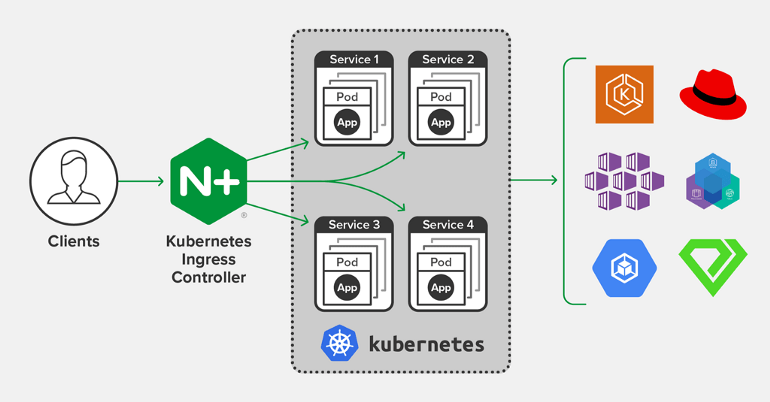
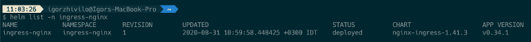
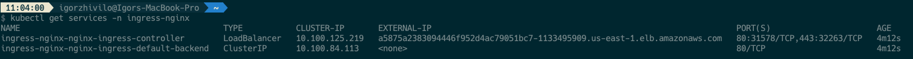
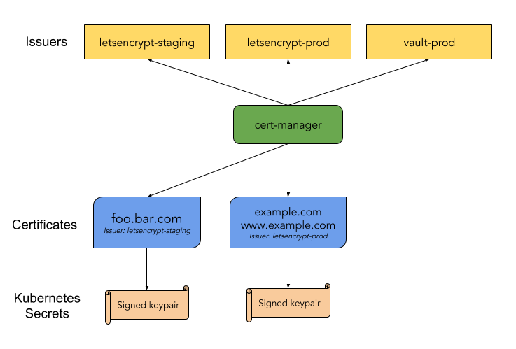

# Building the CI/CD of the Future, NGINX Ingress + Cert-Manager


In this tutorial, I will share my experience as a DevOps engineer at Cloudify.co, this is the fourth post of the tutorial in which I will describe how to add NGINX Ingress and Cert-Manager to the EKS cluster we created in the previous posts.

### Building the CI/CD of the Future published posts:

* [Introduction](README.md)
* [Creating the VPC for EKS cluster](vpc.md)
* [Creating the EKS cluster](eks.md)
* [Add Ingress Nginx and Cert-Manager](ingress-cert-manager.md)
* Add Ingress Nginx and Cert-Manager
* [Install and configure Jenkins](jenkins.md)
* [Create your first pipeline](pipeline.md)

Let’s start.

## What is Ingress?

Ingress exposes HTTP and HTTPS routes from outside the cluster to services within the cluster. Traffic routing is controlled by rules defined on the Ingress resource.

internet
|

[ Ingress ]

--|-----|--

[ Services ]

An Ingress may be configured to give Services externally-reachable URLs, load balance traffic, terminate SSL / TLS, and offer name based virtual hosting. An Ingress controller is responsible for fulfilling the Ingress, usually with a load balancer, though it may also configure your edge router or additional frontends to help handle the traffic.

https://kubernetes.io/docs/concepts/services-networking/ingress/

## What is NGINX Ingress?

ingress-nginx is an Ingress controller for Kubernetes using NGINX as a reverse proxy and load balancer.

https://github.com/kubernetes/ingress-nginx



To install Nginx Ingress we will use the Helm package manager.

## Install Helm package manager

Helm is a package manager for Kubernetes that allows developers and operators to more easily package, configure, and deploy applications and services onto Kubernetes clusters.

Follow this [reference](https://helm.sh/docs/intro/install/) to install Helm, I installed helm on my mac using the homebrew:

``` bash
brew install helm
```

I am using helm v3 in this tutorial

### Adding the Stable Repo to Helm v3

``` bash
helm repo add stable https://kubernetes-charts.storage.googleapis.com/
```

## Install the NGINX Ingress

Let’s create an ‘ingress-nginx’ namespace to which ingress-nginx will be installed using helm.

``` bash
kubectl create ns ingress-nginx
helm install ingress-nginx stable/nginx-ingress -n ingress-nginx
```




You can see a service of the LoadBalancer type created, which will be the entry point to our EKS cluster:





DNS name of created LB is: a5875a2383094446f952d4ac79051bc7–1133495909.us-east-1.elb.amazonaws.com

## Create the DNS record which points to our EKS cluster

Let’s assume our domain is: cicd-future.com

Our EKS cluster’s domain is: eks.cicd-future.com

We need to add A record \*.eks.cicd-future.com which points to created LoadBalancer service, it’s basically an alias which points to created LB by Ingress

If you use route53 of AWS go to Route53 -> Hosted Zones -> ‘cicd-future.com’ and add new A record which points to created LB



To check you defined correctly A record, use ‘dig’


``` bash
dig eks.cicd-future.com
```

‘A’ records returned by ‘dig eks.cicd-future.com’ and ‘dig a5875a2383094446f952d4ac79051bc7–1133495909.us-east-1.elb.amazonaws.com’ must be the same.

``` bash
curl eks.cicd-future.com
default backend - 404%
```

Standard response for NGINX ingress if rule not defined.

## Validating EKS cluster reachable through DNS

To test everything configured properly we will deploy a simple Nginx server with ingress rule:

``` bash
kubectl run nginx --image nginx
kubectl expose deploy nginx --port 80
```

Save and deploy the NGINX Ingress rule:

Save as ingress-nginx.yaml

``` yaml
apiVersion: extensions/v1beta1
kind: Ingress
metadata:
  name: nginx-test
  annotations:
    kubernetes.io/ingress.class: "nginx"
spec:
  rules:
  - host: test.eks.cicd-future.com
    http:
      paths:
      - path: /
        backend:
          serviceName: nginx
          servicePort: 80

```

Deploy ingress rule

``` bash
kubectl create -f ingress-nginx.yaml
```

Let’s check the response with curl:

``` html
curl test.eks.cicd-future.com


<!DOCTYPE html>
<html>
<head>
<title>Welcome to nginx!</title>
<style>
    body {
        width: 35em;
        margin: 0 auto;
        font-family: Tahoma, Verdana, Arial, sans-serif;
    }
</style>
</head>
<body>
<h1>Welcome to nginx!</h1>
<p>If you see this page, the nginx web server is successfully installed and
working. Further configuration is required.</p>
<p>For online documentation and support please refer to
<a href="http://nginx.org/">nginx.org</a>.<br/>
Commercial support is available at
<a href="http://nginx.com/">nginx.com</a>.</p>
<p><em>Thank you for using nginx.</em></p>
</body>
</html>
```

Looks good, everything working properly.

## What is Cert-Manager?

cert-manager is a native Kubernetes certificate management controller. It can help with issuing certificates from a variety of sources, such as Let’s Encrypt, HashiCorp Vault, Venafi, a simple signing key pair, or self signed.

It will ensure certificates are valid and up to date, and attempt to renew certificates at a configured time before expiry.

https://cert-manager.io/docs/


## Install cert-manager to our EKS cluster with helm

https://cert-manager.io/docs/installation/kubernetes/

Create the namespace, add helm repository and install cert-manager

Create cert-manager namespace

``` bash
kubectl create namespace cert-manager
```

Add the Jetstack Helm repository

``` bash
helm repo add jetstack https://charts.jetstack.io
```

Update your local Helm chart repository cache

``` bash
helm repo update
```

Install needed CRDs

``` bash
kubectl apply --validate=false -f https://raw.githubusercontent.com/jetstack/cert-manager/release-0.14/deploy/manifests/00-crds.yaml
```

Install using helm v3+

``` bash
helm install \
  cert-manager jetstack/cert-manager \
  --namespace cert-manager \
  --version v0.14
```

## Verifying the installation

``` bash
kubectl get pods --namespace cert-manager

NAME                                       READY   STATUS    RESTARTS   AGE
cert-manager-5c6866597-zw7kh               1/1     Running   0          2m
cert-manager-cainjector-577f6d9fd7-tr77l   1/1     Running   0          2m
cert-manager-webhook-787858fcdb-nlzsq      1/1     Running   0
```

You should see the cert-manager, cert-manager-cainjector, and cert-manager-webhook pod in a Running state. It may take a minute or so for the TLS assets required for the webhook to function to be provisioned. This may cause the webhook to take a while longer to start for the first time than other pods. If you experience problems, please check the [FAQ guide](https://cert-manager.io/docs/faq/).

## Configure Cluster Issuer to issue Let’s Encrypt certificates

To obtain Let’s Encrypt certificates we need to create an issuer, it may be Issuer or ClusterIssuer, the difference is that an [Issuer](https://docs.cert-manager.io/en/release-0.8/reference/issuers.html) is scoped to a single namespace and ClusterIssuer is a cluster-wide version of an Issuer.

Let’s Encrypt Issuer have staging and production environments, you can start with staging issuer for testing, it has more appropriate(extended) rate limits for testing, but I will concentrate in this tutorial on the creation of production ClusterIssuer:

``` yaml
apiVersion: cert-manager.io/v1alpha3
kind: ClusterIssuer
metadata:
  name: letsencrypt-prod
spec:
  acme:
    # The ACME server URL
    server: https://acme-v02.api.letsencrypt.org/directory
    # Email address used for ACME registration
    email: admin@eks.cicd-future.com
    # Name of a secret used to store the ACME account private key
    privateKeySecretRef:
      name: letsencrypt-prod
    # Enable the HTTP-01 challenge provider
    solvers:
    - http01:
        ingress:
          class: nginx
```

We using [HTTP Validation](https://cert-manager.io/docs/tutorials/acme/http-validation/) and [ACME protocol](https://cert-manager.io/docs/tutorials/acme/http-validation/) for ClusterIssuer

Deploy clusterissuer.yaml

``` bash
kubectl create -f clusterissuer.yaml
```

## Issue a new Let’s Encrypt certificate for test.eks.cicd-future.com

To issue a new certificate we will modify the ingress rule for ‘nginx’ server, pay attention to ‘annotations’ and ‘tls’ parts.

``` yaml
apiVersion: extensions/v1beta1
kind: Ingress
metadata:
  name: nginx-test
  annotations:
    kubernetes.io/ingress.class: "nginx"
    cert-manager.io/cluster-issuer: "letsencrypt-prod"
spec:
  tls:
  - hosts:
    - test.eks.cicd-future.com
    secretName: test-tls-prod
  rules:
  - host: test.eks.cicd-future.com
    http:
      paths:
      - path: /
        backend:
          serviceName: nginx
          servicePort: 80
```

``` bash
kubectl create -f my-ingress.yaml
```

Now you need to wait till Cert-Manager acquires a certificate for the test.eks.cicd-future.com domain, it may take some time. When the certificate will be acquired you will be able to reach test.eks.cicd-future.com using the HTTPS.

You can check acquired certificates and status using ‘kubectl’:

``` bash
kubectl get certificates -n cert-manager
```

In this post, I explained how to install and configure NGINX Ingress for your EKS cluster, create a DNS record with route53 which points to your EKS cluster, how to install and configure Cert-Manager with ClusterIssuer and Let’s Encrypt certificates.

Please follow me on [Twitter (@warolv)](https://twitter.com/warolv)

My personal blog in which I will post this tutorial also: http://igorzhivilo.com

This post on my medium account: https://medium.com/@warolv/building-the-ci-cd-of-the-future-nginx-ingress-cert-manager-945f3dc6b12e
