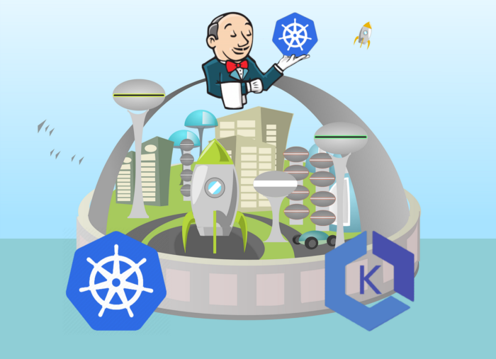
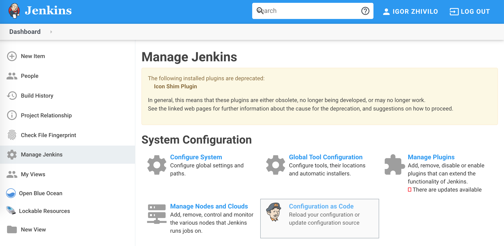
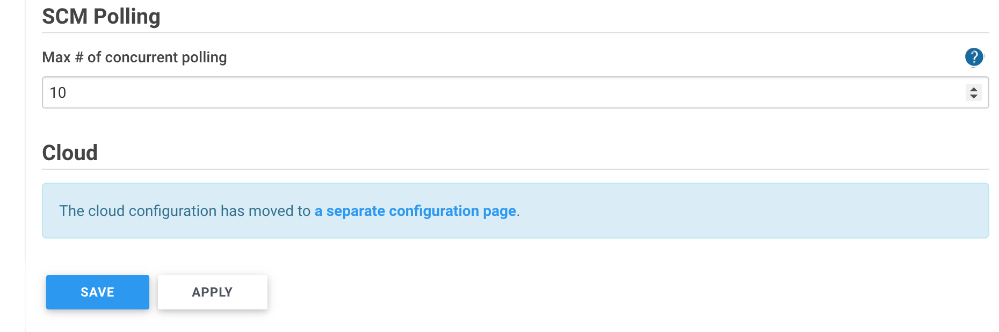
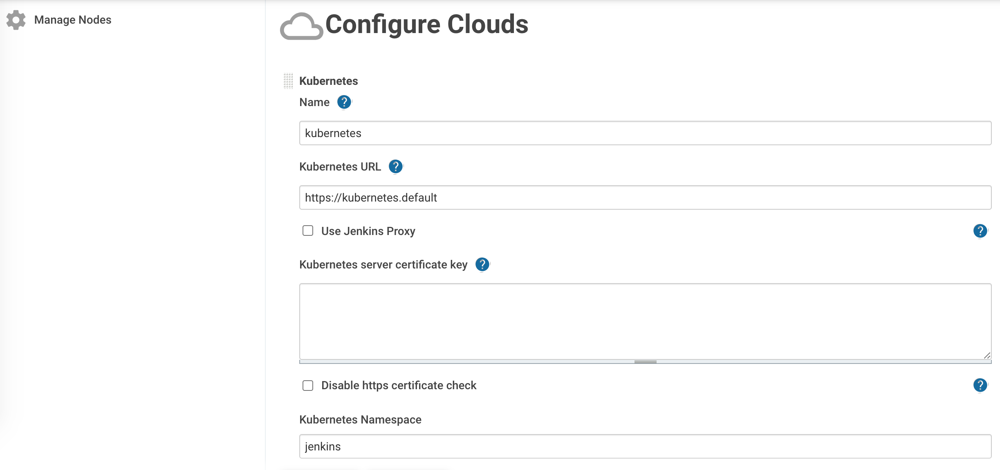
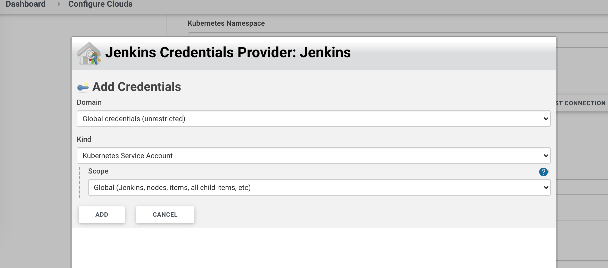
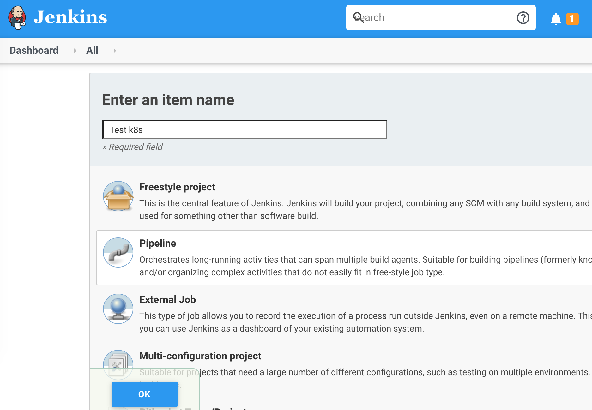

# Building the CI/CD of the Future, create your first pipeline in Jenkins



In this tutorial, I will share my experience as a DevOps engineer at Cloudify.co, this is the last post of the tutorial in which I will describe how to configure Jenkins Kubernetes plugin and how to create your first pipeline.

### Building the CI/CD of the Future published posts:

* [Introduction](README.md)
* [Creating the VPC for EKS cluster](vpc.md)
* [Creating the EKS cluster](eks.md)
* [Adding the Cluster Autoscaler](cluster-autoscaler.md)
* [Add Ingress Nginx and Cert-Manager](ingress-cert-manager.md)
* [Install and configure Jenkins](jenkins.md)
* Create your first pipeline

Let’s start.

## Kubernetes plugin for Jenkins

Jenkins plugin to run dynamic agents in a Kubernetes cluster.

https://plugins.jenkins.io/kubernetes/

## Login to Jenkins

I explained how to get the password in the previous post: [Install and configure Jenkins](jenkins.md)

### Get the admin password of Jenkins

``` bash
printf $(kubectl get secret --namespace jenkins jenkins -o jsonpath="{.data.jenkins-admin-password}" | base64 --decode);echo
```

## Configure Jenkins Kubernetes plugin

Go to dashboard -> Manage Jenkins -> Configure system



At the bottom of the page, you will see ‘Cloud’ section which is the configuration of the Jenkins Kubernetes plugin



Click on ‘a separate configuration page’



### Let’s configure the most important fields:

*Name:* Kubernetes

``` bash
kubectl get svc -n default

NAME         TYPE        CLUSTER-IP   EXTERNAL-IP   PORT(S)   AGE
kubernetes   ClusterIP   10.100.0.1   <none>        443/TCP   1d
```
*Kubernetes URL:* https://kubernetes.default

*Kubernetes Namespace:* jenkins (if you installed Jenkins to this namespace)

Credentials: click on Credentials -> add, select kind: ‘Kubernetes service account’



You created this service account in previous post, jenkins service account: [Install and configure Jenkins](jenkins.md)

Click ‘Test Connection’ to test connectivity with the k8s cluster, if you see some connectivity problem: validate you created service account properly.

*Jenkins URL:* http://jenkins.jenkins.svc.cluster.local:8080

*Jenkins Tunnel:* jenkins-agent.jenkins.svc.cluster.local:50000

``` bash
kubectl get svc -n jenkins

NAME             TYPE        CLUSTER-IP       EXTERNAL-IP   PORT(S)    
jenkins          ClusterIP   10.100.208.3     <none>        8080/TCP    
jenkins-agent    ClusterIP   10.100.169.168   <none>      50000/TCP  
```

Be careful with those two fields, validate you have a correct domain name for jenkins (jenkins.jenkins.svc.cluster.local), meaning jenkins service located in jenkins namespace with port 8080, also jenkins agent is correct, by running ‘kubectl get svc -n jenkins’.

If those fields misconfigured you will have multiple errors when running the pipeline, you can run ’kubectl logs/describe’ on the running pod and see the exact problem. In my case, I misconfigured *Jenkins Tunnel* and had multiple errors in JNLP agent which wasn’t able to connect to Jenkins through the tunnel because the service name I used for Jenkins Tunnel wasn’t correct.

*You can use defaults for the rest.*

## Create a pipeline to test the integration of Jenkins with Kubernetes cluster

Click on Dashboard -> New Item



### Let’s create a pipeline to test integration with Kubernetes by getting pods in all namespaces

We using ‘gcr.io/cloud-builders/kubectl’ docker container with kubectl tool and running ‘kubectl get pods -all-namespaces’, to check we have access to the cluster through the service account we configured.

``` groovy
podTemplate(label: 'mypod', containers: [
    containerTemplate(name: 'kubectl', image: 'gcr.io/cloud-builders/kubectl', command: 'cat', ttyEnabled: true)
  ]
  ) {
    node('mypod') {
        stage('Kubectl testing with k8s cluster') {
            container('kubectl') {
                sh("kubectl get pods --all-namespaces")
            }
        }
    }
}
```


Click to save, go to this pipeline and run build:

You can use nodeSelector if you use labels for worker nodes and want to run pipeline on specific worker nodes (I want to run pipeline on spot in this case):

``` groovy
podTemplate(label: 'mypod', nodeSelector: 'instance-type: spot', containers: [
    containerTemplate(name: 'kubectl', image: 'gcr.io/cloud-builders/kubectl', command: 'cat', ttyEnabled: true)
  ]
  ) {
    node('mypod') {
        stage('Kubectl testing with k8s cluster') {
            container('kubectl') {
                sh("kubectl get pods --all-namespaces")
            }
        }
    }
}
```

* In the console output, you will see something similar to that *

``` bash
[Pipeline] Start of Pipeline
[Pipeline] podTemplate
[Pipeline] {
[Pipeline] node
Still waiting to schedule task
Created Pod: kubernetes jenkins/mypod-88fnc-fttdj
[Normal][jenkins/mypod-88fnc-fttdj][Scheduled] Successfully assigned jenkins/mypod-88fnc-fttdj to ip-192-168-36-50.eu-west-1.compute.internal
[Normal][jenkins/mypod-88fnc-fttdj][Pulled] Container image "gcr.io/cloud-builders/kubectl" already present on machine
[Normal][jenkins/mypod-88fnc-fttdj][Created] Created container kubectl
[Normal][jenkins/mypod-88fnc-fttdj][Started] Started container kubectl
[Normal][jenkins/mypod-88fnc-fttdj][Pulled] Container image "jenkins/inbound-agent:4.3-4" already present on machine
[Normal][jenkins/mypod-88fnc-fttdj][Created] Created container jnlp
[Normal][jenkins/mypod-88fnc-fttdj][Started] Started container jnlp
Agent mypod-88fnc-fttdj is provisioned from template mypod-88fnc
---
apiVersion: "v1"
kind: "Pod"
metadata:
  annotations:
    buildUrl: "http://jenkins.jenkins.svc.cluster.local:8080/job/Test%20k8s/2/"
    runUrl: "job/Test%20k8s/2/"
  labels:
    jenkins: "slave"
    jenkins/label-digest: "151e26c22cfdf1016d63f0cc3b4c6eeaf431ba3c"
    jenkins/label: "mypod"
  name: "mypod-88fnc-fttdj"
spec:
  containers:
  - command:
    - "cat"
    image: "gcr.io/cloud-builders/kubectl"
    imagePullPolicy: "IfNotPresent"
    name: "kubectl"
    resources:
      limits: {}
      requests: {}
    tty: true
    volumeMounts:
    - mountPath: "/home/jenkins/agent"
      name: "workspace-volume"
      readOnly: false
  - env:
    - name: "JENKINS_SECRET"
      value: "********"
    - name: "JENKINS_TUNNEL"
      value: "jenkins-agent.jenkins.svc.cluster.local:50000"
    - name: "JENKINS_AGENT_NAME"
      value: "mypod-88fnc-fttdj"
    - name: "JENKINS_NAME"
      value: "mypod-88fnc-fttdj"
    - name: "JENKINS_AGENT_WORKDIR"
      value: "/home/jenkins/agent"
    - name: "JENKINS_URL"
      value: "http://jenkins.jenkins.svc.cluster.local:8080/"
    image: "jenkins/inbound-agent:4.3-4"
    name: "jnlp"
    resources:
      limits: {}
      requests:
        memory: "256Mi"
        cpu: "100m"
    volumeMounts:
    - mountPath: "/home/jenkins/agent"
      name: "workspace-volume"
      readOnly: false
  restartPolicy: "Never"
  volumes:
  - emptyDir:
      medium: ""
    name: "workspace-volume"
Running on mypod-88fnc-fttdj in /home/jenkins/agent/workspace/Test k8s
[Pipeline] {
[Pipeline] stage
[Pipeline] { (Kubectl testing with k8s cluster)
[Pipeline] container
[Pipeline] {
[Pipeline] sh

+ kubectl get pods --all-namespaces
NAMESPACE  NAME               READY   STATUS      RESTARTS   AGE
jenkins    mypod-88fnc-fttdj  2/2     Running     0          7s
...
```

In case you have some problems, troubleshoot your pod with ‘kubectl describe/logs’

``` bash
kubectl describe pod mypod-88fnc-fttdj
kubectl logs pod mypod-88fnc-fttdj
kubectl logs pod mypod-88fnc-fttdj -c jnlp
```

It was the last post of the ‘Building the CI/CD of the Future’ series.
In this post, I covered how to configure Jenkins Kubernetes plugin and how to create your first pipeline to test connectivity with Kubernetes cluster from Jenkins by listing all the pods.

Thank you for reading, it was a great journey and I hope you enjoyed it.

Please follow me on Twitter (@warolv)

My personal blog in which I will post this tutorial also: http://igorzhivilo.com

This post on my medium account: https://warolv.medium.com/building-the-ci-cd-of-the-future-create-your-first-pipeline-in-jenkins-a10ab0baa95f
