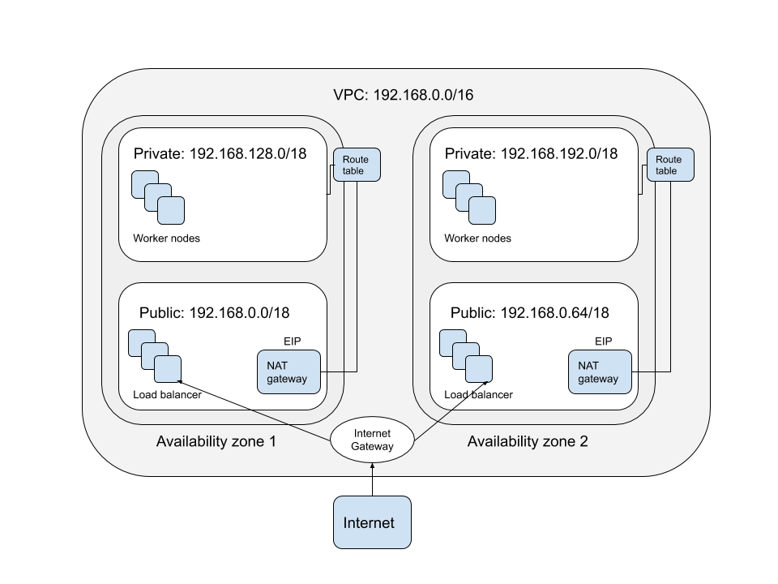
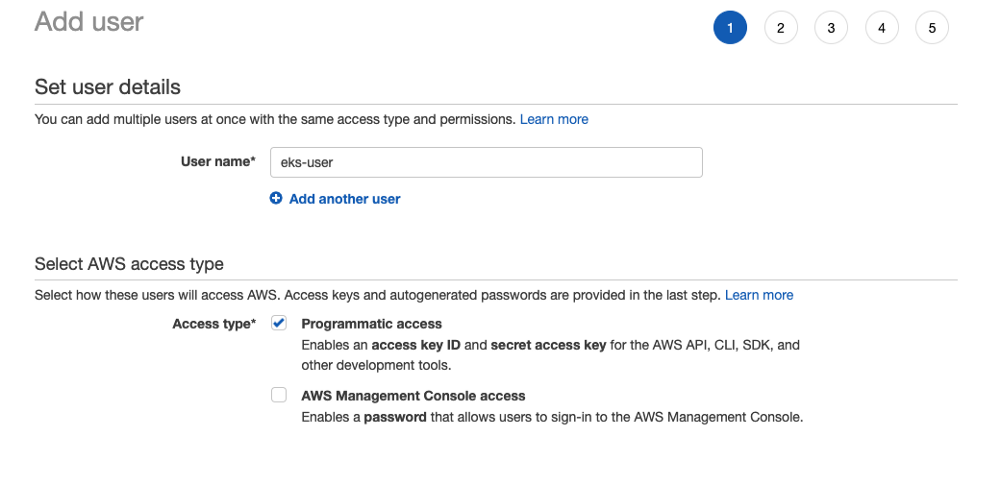
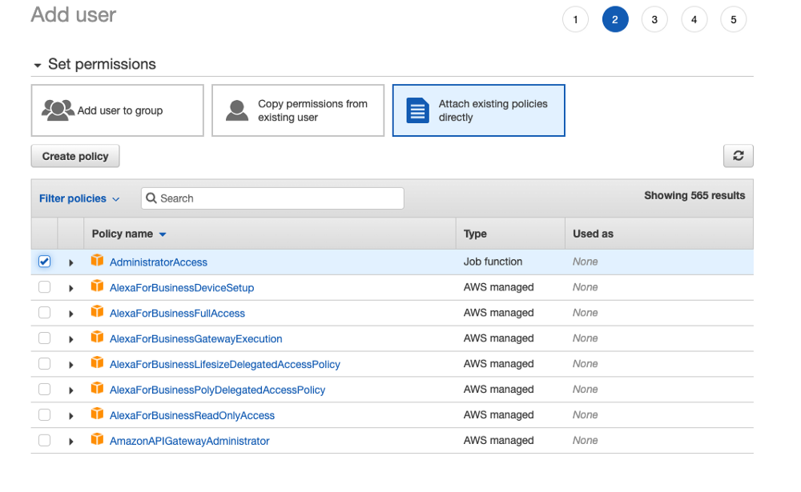
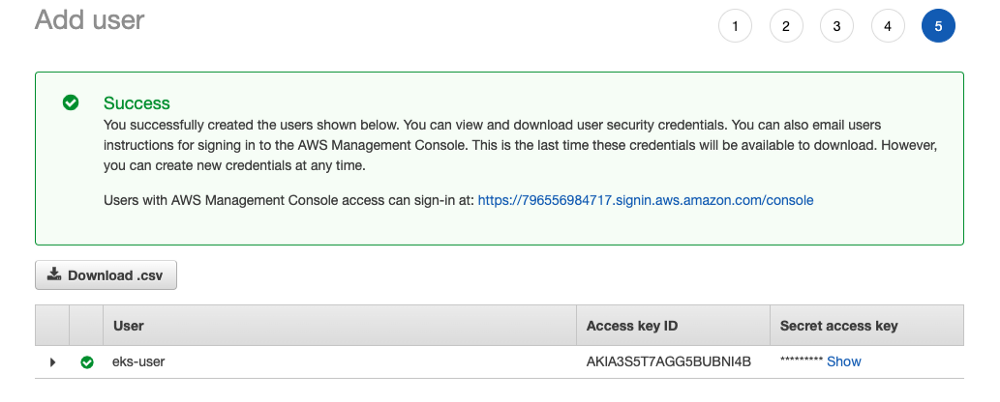
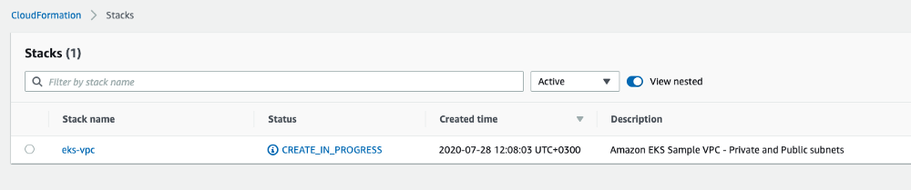
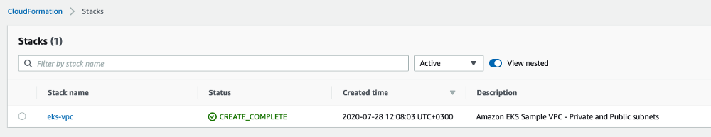
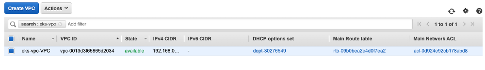

# Building the CI/CD of the Future, creating the VPC for EKS cluster


In this tutorial, I will share my experience as a DevOps engineer at Cloudify.co, this is the first post of tutorial in which I will describe how to create VPC for EKS cluster of our CI/CD based on Jenkins.

### Building the CI/CD of the Future published posts:

* [Introduction](README.md)
* Creating the VPC for EKS cluster
* [Creating the EKS cluster](eks.md)
* [Adding the Cluster Autoscaler](cluster-autoscaler.md)
* [Add Ingress Nginx and Cert-Manager](ingress-cert-manager.md)

## What is Amazon VPC?

Amazon Virtual Private Cloud (Amazon VPC) enables you to launch AWS resources into a virtual network that you've defined. This virtual network closely resembles a traditional network that you'd operate in your own data center, with the benefits of using the scalable infrastructure of AWS.

[AWS VPC](https://docs.aws.amazon.com/vpc/latest/userguide/what-is-amazon-vpc.html)

## Amazon VPC concepts

Subnet - A range of IP addresses in your VPC.

Route table - A set of rules, called routes, that are used to determine where network traffic is directed.

Internet gateway - A gateway that you attach to your VPC to enable communication between resources in your VPC and the internet.

VPC endpoint - Enables you to privately connect your VPC to supported AWS services and VPC endpoint services powered by PrivateLink without requiring an internet gateway, NAT device, VPN connection, or AWS Direct Connect connection. Instances in your VPC do not require public IP addresses to communicate with resources in the service. Traffic between your VPC and the other service does not leave the Amazon network.

[VPC concepts](https://docs.aws.amazon.com/vpc/latest/userguide/VPC_Subnets.html)

## Two options for creating VPC for EKS cluster

* Provision first your VPC using tools like CloudFormation or Terraform and then create an EKS cluster on top of it.

* Create a VPC using tools like 'eksctl' which creates automatically VPC for your EKS cluster.

Second option less preferred because you don't have full control over all the process, you can't be sure about aspects like worker nodes you provision will be a part of public subnet with attached public IP or in a private subnet.

You can read on the [AWS website](https://docs.aws.amazon.com/eks/latest/userguide/create-public-private-vpc.html
) more info about this

*If you deployed a VPC using eksctl or by using either of the Amazon EKS AWS CloudFormation VPC templates:
On or after 03/26/2020 - Public IPv4 addresses are automatically assigned by public subnets to new worker nodes deployed to public subnets.
Before 03/26/2020 - Public IPv4 addresses are not automatically assigned by public subnets to new worker nodes deployed to public subnets.*

Of course, if you do the provision of VPC using the 'eksctl' utility, you not completely understand what components created on AWS eventually, so I encourage you to do it manually, meaning first create the VPC and only then the EKS cluster.

## Another important consideration if VPC have

* Private subnets only
* Public subnets only
* Private and Public subnets

For the CI/CD case, the third option will be the best, I need private and public subnets, our Jenkins master will have a public IP and will be reachable through web hooks of Github. 

The workloads will be executed on worker nodes provisioned in private subnets which don't have a public IP and SSH access, according to security best practices.

### Recommended by AWS

*We recommend a VPC with public and private subnets so that Kubernetes can create public load balancers in the public subnets that load balance traffic to pods running on worker nodes that are in private subnets.*

I guess VPC with public subnets only used for demonstration purposes only, cause it does not feels very secure to have a public IP for each worker node you provision.

## Resiliency

Amazon EKS requires subnets in at least two Availability Zones, for resiliency, it is advisable to always have 2 public and 2 private subnets and ensure they are both in different availability zones.

Of course, more availability zones event better and more suitable for production cluster, but to simplify all the process I will create EKS cluster with two availability zones.

## Creating a VPC for EKS cluster



To create VPC for our EKS cluster I will use AWS CloudFormation template

https://amazon-eks.s3.us-west-2.amazonaws.com/cloudformation/2020-06-10/amazon-eks-vpc-private-subnets.yaml

## VPC components of EKS cluster

* VPC: 192.168.0.0/16 (65534 hosts), [IP calculator](https://medium.com/r/?url=http%3A%2F%2Fjodies.de%2Fipcalc%3Fhost%3D192.168.0.0%26mask1%3D16%26mask2%3D)
* 2 public subnets: 192.168.0.0/18 and 192.168.64.0/18, (16382 hosts in each subnet), [IP calculator](https://medium.com/r/?url=http%3A%2F%2Fjodies.de%2Fipcalc%3Fhost%3D192.168.0.0%26mask1%3D18%26mask2%3D)
* 2 private subnets: 192.168.128.0/18 and 192.168.192.0/18 (16382 hosts in each subnet), [IP calculator](https://medium.com/r/?url=http%3A%2F%2Fjodies.de%2Fipcalc%3Fhost%3D192.168.128.0%26mask1%3D18%26mask2%3D)
* InternetGateway connected to VPC and public subnets
* 2 NAT gateways with 2 Elastic IPs in public subnets, one in each public subnet. Each private subnet connected to NAT gateway via routing table
* Other components like RouteTables and RouteTableAssociation …

## Creating VPC for EKS cluster

### Prerequisites

* You must have an AWS account

### Creating IAM user on AWS with programmatic access

In AWS account go to Services -> IAM -> Users -> Add User



Attach 'AdministratorAccess' policy



I used 'AdministratorAccess' policy to simplify the process, otherwise you need to attach a lot of different policies for VPC/EKS creation and that not something I want to focus on in this tutorial.

Create the user and download .csv file with credentials for programmatic access to AWS



### Install AWS Cli

https://docs.aws.amazon.com/cli/latest/userguide/install-cliv2.html

### AWS configuration

``` bash
aws configure
```

Set your AWS Access Key ID / AWS Secret Access Key / Default region name from csv file you downloaded

### Create the VPC using the cloud formation template and AWS Cli

Download CloudFormation template from [here](https://medium.com/r/?url=https%3A%2F%2Famazon-eks.s3.us-west-2.amazonaws.com%2Fcloudformation%2F2020-06-10%2Famazon-eks-vpc-private-subnets.yaml) , I assume file in 'downloads' folder, name of stack you creating is 'eks-vpc' and region is 'us-east-1'

``` bash
aws cloudformation create-stack --stack-name eks-vpc --template-body file:///Users/igor/downloads/eks-cluster/eks-cluster/amazon-eks-vpc-private-subnets.yaml --region=eu-west-1
```

In AWS account go to Services -> CloudFormation -> Stacks, you must see







Please follow me on [Twitter (@warolv)](https://twitter.com/warolv)

My personal blog in which I will post this tutorial also: http://igorzhivilo.com

This post on my medium account: https://medium.com/@warolv/building-the-ci-cd-of-the-future-creating-the-vpc-for-eks-cluster-a69b085441d1
